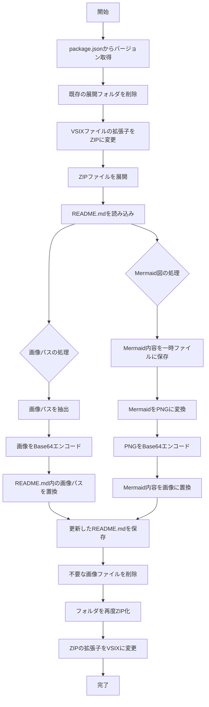

プライベートなVS Code拡張機能（vsixを手動インストールする場合）にREADMEで画像とMermaidの図が表示できない問題への対応スクリプトを紹介するためのリポジトリです。
詳細はZenの記事「[社内でのみ共有したい自作VS Code拡張機能のREADMEで画像とMermaidの図が表示できない問題を解決した](https://zenn.dev/yuma_prog/articles/vscode-private-extension-readme-image)」をご覧ください。
[vscode-extension-samples/chat-sample](https://github.com/microsoft/vscode-extension-samples/tree/main/chat-sample)をベースにしています。

# 画像表示テスト
パブリックに公開したくない画像：images/private.png


パブリックに公開している画像：images/public.jpg


パブリックに公開している画像：https://github.com/yuma-722/test/raw/HEAD/images/public.jpg


# 前提となるディレクトリ構成

postPackage.jsの前提となるディレクトリ構成です。

```markdown
VS Code 拡張機能のroot/
├── package.json
├── scripts/
│   └── postPackage.js
└──images/
    └── example.png
```
# postPackage.jsのフロー

