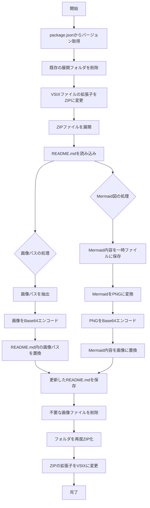

postPackage.jsのフロー

```mermaid
graph TD
    A[開始] --> B[package.jsonからバージョン取得]
    B --> C[既存の展開フォルダを削除]
    C --> D[VSIXファイルの拡張子をZIPに変更]
    D --> E[ZIPファイルを展開]
    
    E --> F[README.mdを読み込み]
    
    F --> G{画像パスの処理}
    G --> H[画像パスを抽出]
    H --> I[画像をBase64エンコード]
    I --> J[README.md内の画像パスを置換]
    
    F --> K{Mermaid図の処理}
    K --> L[Mermaid内容を一時ファイルに保存]
    L --> M[MermaidをPNGに変換]
    M --> N[PNGをBase64エンコード]
    N --> O[Mermaid内容を画像に置換]
    
    J --> P[更新したREADME.mdを保存]
    O --> P
    
    P --> Q[不要な画像ファイルを削除]
    Q --> R[フォルダを再度ZIP化]
    R --> S[ZIPの拡張子をVSIXに変更]
    S --> T[完了]
```